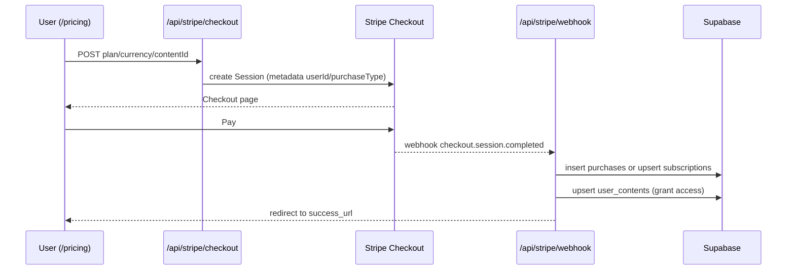
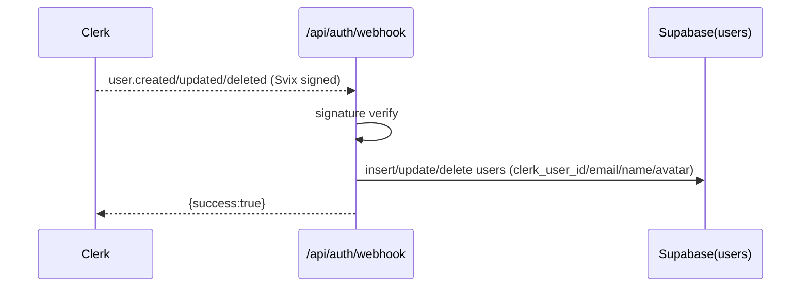

# VibeStack 심층 코드 해설서 (Flow 중심)

## 1) 프로젝트 한 줄 요약
- AI 시대 개발 학습 플랫폼: 튜토리얼/문서/스니펫/번들을 따라 만들며 성장하고, 단건 구매·구독·팀 플랜으로 수익화.

## 2) 전체 지도 (Structure Map)
```
app/                     # Next.js App Router 엔드포인트
  (marketing)/pricing    # 가격/구독 랜딩 → /subscribe
  api/stripe/*           # Stripe Checkout + Webhook
  api/toss/*             # Toss 결제 Webhook
  api/auth/webhook       # Clerk → Supabase 사용자 동기화
  api/content/*          # 콘텐츠 조회수 트래킹, 검색, 단건 조회
  actions/               # 서버 액션 (콘텐츠 CRUD/통계 등)
components/              # UI 컴포넌트 (checkout, onboarding, admin, content trackers)
lib/                     # 외부 서비스 래퍼 (supabase, auth, stripe, algolia, env)
Document/                # 설계/PRD/ERD/운영 문서
supabase/migrations/     # 스키마 및 정책 (최신: users.banned 추가)
```
- `lib/auth.ts`: Clerk 인증 + Supabase `users.role` 검사로 RBAC.  
- `lib/supabase.ts`: anon/client vs service role(admin) 분리, RLS 우회 작업 전용.  
- `lib/algolia.ts`: 검색/인덱싱 래퍼, 인덱스 미존재 시 안전 빈 결과.  
- `app/actions/content.ts`: 콘텐츠 조회/생성/수정/삭제, 조회수·완료수 증가, 번들 children 조회.  
- `components/content/view-tracker.tsx`: 5초 대기 후 조회수 POST, 쿠키로 중복 방지.  
- `supabase/migrations/20241211_07_add_user_banned.sql`: `users.banned` 컬럼 + 부분 인덱스(`banned=true`) 추가, 차단 관리용.

## 3) 핵심 로직 흐름 (Data Flow)

### A. 단건 구매 & 구독 (Stripe)

- Checkout 생성: `app/api/stripe/checkout/route.ts`  
  - Clerk `auth()`로 로그인 확인.  
  - plan/currency 검증 → Stripe Session 생성, `metadata`에 `userId/purchaseType/contentId` 주입.  
- Webhook: `app/api/stripe/webhook/route.ts`  
  - 시그니처 검증 → 이벤트별 핸들러.  
  - `checkout.session.completed`:  
    - 단건: `purchases` insert → `user_contents` upsert(access_type `purchased`) → `users.purchase_credits` 적립.  
    - 구독: `subscriptions` upsert(`plan_type/status/period`) (user당 1개 onConflict).  
  - 갱신/실패/취소/환불도 동일 레코드 업데이트로 멱등 유지.  

### B. 콘텐츠 조회수 트래킹
```mermaid
sequenceDiagram
  participant C as Client ViewTracker
  participant API as /api/content/track-view
  participant Action as incrementViewCount
  participant DB as Supabase(contents)

  C-->>C: 5s delay + cookie(viewed_{id})
  C->>API: POST {contentId}
  API->>Action: incrementViewCount(contentId)
  Action->>DB: select views; update views=views+1 (service key)
  API-->>C: {success:true}; set cookie 1day
```
- `components/content/view-tracker.tsx`: 5초 대기 후 중복 쿠키 체크, API 호출.  
- `app/api/content/track-view/route.ts`: 요청 검증 후 `incrementViewCount` 실행.  
- `app/actions/content.ts`: `supabaseAdmin`으로 RLS 우회, 현재 뷰 카운트 읽고 +1 업데이트.

### C. Clerk 사용자 동기화 → Supabase

- `app/api/auth/webhook/route.ts`: Svix 검증 후 `users` insert/update/delete.  
- DB에서 RBAC/금지(`users.banned`) 관리, Clerk 메타데이터와 분리.

## 4) 주요 코드 딥다이브

### Stripe Webhook 핵심 (`app/api/stripe/webhook/route.ts`)
- **멱등 세이프 가드**: 모든 DB 변경을 `supabaseAdmin` + upsert로 처리 → 재전송에도 일관.  
- **단건 구매 처리**:
  ```ts
  await supabaseAdmin.from('purchases').insert({... status:'completed' })
  await supabaseAdmin.from('user_contents').upsert({ user_id, content_id, access_type:'purchased' }, { onConflict:'user_id,content_id' })
  ```
  - 구매 기록 후 접근권을 단일 테이블 `user_contents`에 집약.  
- **구독 처리**:
  ```ts
  await supabaseAdmin.from('subscriptions').upsert({
    user_id, plan_type, status, current_period_start, current_period_end, cancel_at_period_end
  }, { onConflict:'user_id' })
  ```
  - 사용자당 1레코드 유지, 갱신/취소/결제 실패 이벤트에서 상태/기간 갱신.  
- **환불**: `charge.refunded` 시 `purchases` 상태 업데이트, 전액 환불이면 해당 `user_contents` 삭제.

### 조회수 증가 (`app/actions/content.ts` → `incrementViewCount`)
```ts
const { data: content } = await supabaseAdmin.from('contents').select('views').eq('id', contentId).single()
const newCount = (content.views || 0) + 1
await supabaseAdmin.from('contents').update({ views: newCount }).eq('id', contentId)
```
- RLS 우회(service role)로 안전하게 서버에서만 카운트, 존재 검증 후 업데이트.  
- 클라이언트는 쿠키 + 지연으로 “실제 읽음” 신뢰도 확보.

### 사용자 차단 스키마 (`supabase/migrations/20241211_07_add_user_banned.sql`)
- `users.banned BOOLEAN NOT NULL DEFAULT false` + 부분 인덱스(`banned=true`) → 관리자가 빠르게 차단 사용자 조회/필터.  
- 사용 예시 주석 포함(차단/해제/목록).

## 5) 배운 점 & 리마인드
- 스택: Next.js App Router + Clerk 인증 + Supabase(RLS) + Stripe/Toss + Algolia. 서비스 키는 서버(액션/웹훅)에서만 사용.
- 데이터 모델: `contents` 단일 테이블로 타입 통합, `user_contents`로 접근권 관리, `subscriptions`/`purchases`/`ratings`/`search_logs` 등 추적 테이블 풍부.
- 설계 의도:
  - Stripe 메타데이터로 웹훅 멱등 처리 → 프론트/백 분리, 재전송 안전.
  - 조회수는 쿠키+지연으로 봇/짧은 체류 노이즈 감소.
  - Algolia 클라이언트/어드민 키 분리, 인덱스 없을 때도 500 방지.
  - RBAC은 Supabase `users.role`/`users.banned`에서 관리, Clerk 메타데이터와 분리해 정책 일관성 확보.
- 다음에 개선하면 좋은 점:
  1) `hooks/use-*`, `app/actions/auth|purchase|subscription` TODO 구현 → 프론트 접근 제어와 실제 데이터 연결.  
  2) 구독/구매 성공 후 캐시 무효화/재검증 흐름 추가(예: `/success`에서 `user_contents` 리페치).  
  3) `user_contents` 접근 검증을 공통 미들웨어/헬퍼로 추상화해 중복 제거.  
  4) `users.banned`를 미들웨어나 API 레벨에서 즉시 차단 로직으로 연결.  
  5) 콘텐츠 CRUD ↔ Algolia 인덱싱을 트랜잭션성 있게 묶고 실패 롤백/재시도 전략 마련.
